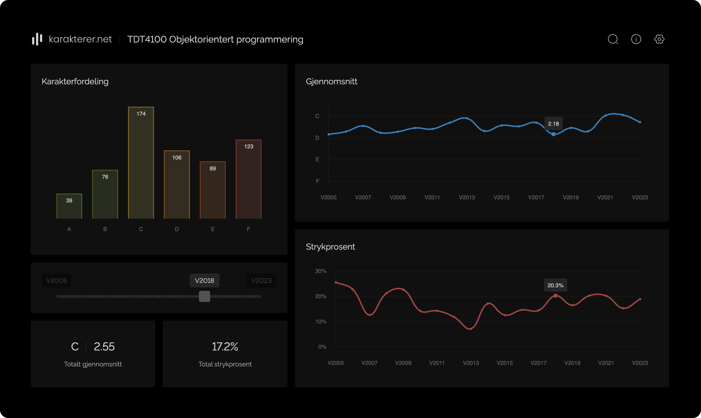

# karakterer.net

A website providing comprehensive grade statistics for all courses offered at the Norwegian University of Science and Technology (NTNU) dating back to 2004. Users can search for courses by code or name, or browse a list of the most viewed courses from the past seven days featured on the homepage. Each course has a dedicated dashboard, presenting semester-wise grade distributions in a bar chart. The dashboard also includes line charts displaying the average grade and failure rate for all semesters, alongside the total average grade and total failure rate. Users can filter by autumn and/or spring semesters.
<br/></br>

<p align="center">
	
</p>

## Developer Guide

This is a [Next.js 12](https://nextjs.org/) project bootstrapped with [`create-next-app`](https://github.com/vercel/next.js/tree/canary/packages/create-next-app), using [`styled-components`]() for styling and [`Prisma`]() for database access.

### Prerequisites

The following is needed to run the project locally:

-   [Git](https://git-scm.com/downloads)
-   [Docker](https://www.docker.com/)
-   [Visual Studio Code](https://code.visualstudio.com/download)
-   [Visual Studio Code Dev Containers extension](https://marketplace.visualstudio.com/items?itemName=ms-vscode-remote.remote-containers)

### Installation and Usage

1. Clone the repository.

1. Create a new file named `.env` in the project root folder. Use the template in [`.env.example`](.env.example) and fill in the placeholders with your values. Make sure to replace `localWorkspaceFolder` with the absolute path to the repository on your local machine.

1. Build and open the dev container with `Dev Containers: Rebuild and Reopen in Container` from the command palette in Visual Studio Code.

    > Later when opening the repository, you only need to open the dev container with `Dev Containers: Reopen in Container`.

1. To run the app, use the following command from the root directory:

    ```
    docker compose up --build
    ```

    > `--build` can be omitted on subsequent runs.

    The app is now available at [http://localhost:3000](http://localhost:3000).

    API routes can be accessed at [http://localhost:3000/api](http://localhost:3000/api/).

#### Database Changes

If changes are made to the database, the Prisma schema must be updated and the client must be regenerated:

1. Update schema: `npx prisma db pull`
2. Regenerate client: `npx prisma generate`

### Build Project

To build the project for production, run:

```bash
npm run build
```

This generates a new folder `.next/standalone` that includes a standalone production build, which can be deployed without installing dependencies. The `public` and `.next/static` folders must be manually copied into `.next/standalone/public` and `.next/standalone/.next/static`. Refer to [Next.js docs](https://nextjs.org/docs/advanced-features/output-file-tracing) for more information.
